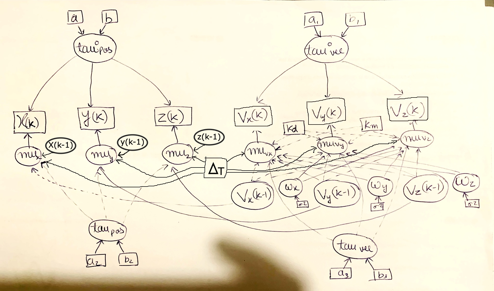
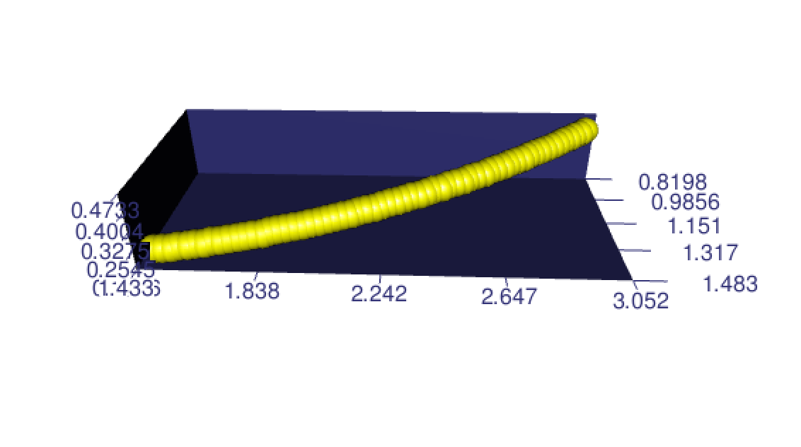

---
---
---

**University of Edinburgh**

**School of Mathematics**

**Bayesian Data Analysis, 2023/2024, Semester 2**

**Assignment 1**

Aryan Verma - S2512060

```{r}
rm(list = ls(all = TRUE))
#Do not delete this!
#It clears all variables to ensure reproducibility
```

**Ping-pong, or table tennis, is a popular sport around the world. In this assignment, we will apply Bayesian modelling to the movement of a ping-pong ball.**

**As explained in the paper "Optimal State Estimation of Spinning Ping-Pong Ball Using Continuous Motion Model" by Zhao et al., the physical equations describing the movement of a spinning ball in air without wind can be described as** $$\frac{d V}{d t}=k_d \|V\|V+k_m \omega\times V+g,$$ **where** $V$ **is the velocity of the ball (3-dimensional vector),** $\omega$ **is the angular velocity (3-dimensional vector),** $g$ **is the local gravity acceleration (3-dimensional vector),** $\times$ **refers to the cross product. The constants** $k_d$ **and** $k_m$ **are expressed as** $$
\begin{split}
k_d&:=-\frac{1}{2m}C_D \rho A \\
k_m&:=\frac{1}{2m}C_m \rho A r. 
\end{split}
$$ **The meaning and values of the parameters here are shown in the following table. **

**We observe positions and velocities at times** $T_1, T_2,\ldots, T_n$**, and define** $\Delta_k=T_{k+1}-T_k$**. The simplest way to discretize this ODE is as follows(Euler-Mayurama discretization of the original ODE, see equation (2) of "Optimal State Estimation of Spinning Ping-Pong Ball Using Continuous Motion Model"),**

$$
\left[\begin{matrix}x(k+1)\\ y(k+1) \\ z(k+1) \\ v_x(k+1) \\ v_y(k+1) \\ v_z(k+1)\end{matrix}\right]=
\left[\begin{matrix}x(k)\\ y(k) \\ z(k) \\ v_x(k) \\ v_y(k) \\ v_z(k)\end{matrix}\right]+\left[\begin{matrix}v_x(k)\\ v_y(k) \\ v_z(k) \\ -k_d \|V(k)\|v_x(k)+k_m(\omega_y v_z(k)-\omega_z v_y(k)) \\ -k_d \|V(k)\|v_y(k)+k_m(\omega_z v_x(k)-\omega_x v_z(k)) \\ -k_d \|V(k)\|v_z(k)+k_m(\omega_x v_y(k)-\omega_y v_x(k))\end{matrix}\right]\cdot \Delta_k,
$$ **where** $\|V(k)\|=\sqrt{v_x(k)^2+v_y(k)^2+v_z(k)^2}$ **is the magnitude of velocity at time** $T_k$**.**

**In this question, we are going to assume a similar model, but with additional Gaussian model noise, and also assume that the position and velocity observations are also subject to observation noise. Hence, our model equations are as follows,**$$
\left[\begin{matrix}x(k+1)\\ y(k+1) \\ z(k+1) \\ v_x(k+1) \\ v_y(k+1) \\ v_z(k+1)\end{matrix}\right]\sim N\left[
\left[\begin{matrix}x(k)\\ y(k) \\ z(k) \\ v_x(k) \\ v_y(k) \\ v_z(k)\end{matrix}\right]+\left[\begin{matrix}v_x(k)\\ v_y(k) \\ v_z(k) \\ -k_d \|V(k)\|v_x(k)+k_m(\omega_y v_z(k)-\omega_z v_y(k)) \\ -k_d \|V(k)\|v_y(k)+k_m(\omega_z v_x(k)-\omega_x v_z(k)) \\ -k_d \|V(k)\|v_z(k)+k_m(\omega_x v_y(k)-\omega_y v_x(k))\end{matrix}\right]\cdot \Delta_k,\Sigma\right],
$$

**where** $\Sigma=Diag[\tau_{pos}^{-1},\tau_{pos}^{-1},\tau_{pos}^{-1},\tau_{vel}^{-1},\tau_{vel}^{-1},\tau_{vel}^{-1}]$ **is a diagonal covariance matrix depending on parameters** $\tau_{pos}$ **and** $\tau_{vel}$**.**

**The observation model is the following,**$$
\left[\begin{matrix}x^o(k)\\ y^o(k) \\ z^o(k) \\ v_x^o(k) \\ v_y^o(k) \\ v_z^o(k)\end{matrix}\right]\sim N\left[
\left[\begin{matrix}x(k)\\ y(k) \\ z(k) \\ v_x(k) \\ v_y(k) \\ v_z(k)\end{matrix}\right],\Sigma^{o}\right],
$$

**where** $\Sigma^o=Diag[(\tau_{pos}^o)^{-1},(\tau_{pos}^o)^{-1},(\tau_{pos}^o)^{-1},(\tau_{vel}^o)^{-1},(\tau_{vel}^o)^{-1},(\tau_{vel}^o)^{-1}]$

**Q1) [10 marks]**

**a) [5 marks] Draw a DAG representation of this model (this can be done one a tablet, or draw it on a piece of paper and then take a picture or scan).**



**b) [5 marks] For the initial values, choose priors of the form**$x(1)\sim N(0,1), y(1)\sim N(0, 1), z(1)\sim N(0,1)$, $v_x(1)\sim N(0,25), v_y(1)\sim N(0,25), v_z(1)\sim N(0,25).$**Choose your own priors for** $\tau_{pos}$**,** $\tau_{vel}$**,** $\tau_{pos}^{o}$**,** $\tau_{vel}^{o}$ **,** $\omega_{x}$**,** $\omega_{y}$**,** $\omega_z$**. Explain your choices.**

**If you use informative priors, please cite the source of the information you used precisely (i.e. web link, or precise page number in a paper. Saying Google search said " " will not suffice).**

[**Answer**]{.underline} **: Initial State Priors**

-   x(1), y(1), z(1): The chosen prior by us N(0, 1) indicates that we are assuming that the ping-pong ball starts near the origin with some uncertainty as we are putting the standard deviation equal to 1.

-   v_x(1), v_y(1), v_z(1): Also, here in velocity prior we have N(0, 25) indicating a similar assumption of starting near zero velocity, but we are accounting for more significant uncertainty in the initial velocity by mentioning a greater standard deviation.

**Precision Parameter Priors (**$\tau_{pos}$**,** $\tau_{vel}$**,** $\tau_{pos}^{o}$**,** $\tau_{vel}^{o}$**)**

-   $\tau_{pos}$**,** $\tau_{vel}$ : Gamma(0.1,0.1) As these precision params reflect the certainity in the accuracy of our model's predictions of position and velocity respectively, and also, as the variance of the model or of the model can't be negative, I use a weakly informative prior as a gamma distribution with a 0.1 as the shape and scale parameter that puts most of its **probability mass on moderate precision values**.

-   $\tau_{pos}^{o}$**,** $\tau_{vel}^{o}$**:** Gamma(0.1,0.01) - As described in the study [1] by the authors, the **imaging equipment** used for the trajectory estimation and capturing the motion of a ping pong ball work in 2-D space, which is put to some algorithms and further the 3D trajectories are calculated. Also, the cameras **differ in their sampling frequency and the object position calculation** thresholds (the computer's inherent calculation limitations in floats and decimals), we resort to choose a **very weakly informative gamma distribution** that's more spread out. As, we still know that the **precision or the variance will not be negative,** hence we resort to the gamma. Hence, this time thinking about the **precision of your sensors, and the potential calculation errors**, prior chosen is gamma with 0.1 as shape and 0.01 as the scale parameter, allowing more flexibility.

    [1] Lin HI, Yu Z, Huang YC. Ball Tracking and Trajectory Prediction for Table-Tennis Robots. Sensors (Basel). 2020 Jan 7;20(2):333. doi: 10.3390/s20020333. PMID: 31936032; PMCID: PMC7014400.

-   **Angular Velocity Priors** $\omega_{x}$**,** $\omega_{y}$**,** $\omega_z$

    N (0,0.001) We have the idea that a ping-pong ball at the very start of its motion do not have any angular velocity, and also when hit it gains the angular velocity, and hence, starts its rotation in either clockwise or anti-clockwise direction which pertain to **positive or negative angular velocity**. Hence, with this idea of the **start and gradual obtaining the motion**, a weakly informative prior such as a normal distribution can be used which is **centered around zero** with a relatively **large standard deviation**.

**Q2) [10 marks] In this question, we are going to fit the model of Q1) on a real dataset from [Table Tennis Ball Trajectories with Spin - Edmond (mpg.de)]. In this dataset, there are many recorded trajectories of ping-pong balls shot out by a table tennis launcher robot. We will only use one trajectory here.**

**First, we load the dataset, and show a 3D plot of the trajectory.**

```{r}
#If you do not have BiocManager and rhdf5 packages installed, you need to install these first. 
#install.packages("BiocManager")
#BiocManager::install("rhdf5")
library(rhdf5)
#This command lists all the information in this dataset.
#Please do not include it in the knitted PDF, as it takes 20+ pages
#h5ls("MN5008_grid_data_equal_speeds.hdf5",)
n=60;
xyz.obs<-h5read("MN5008_grid_data_equal_speeds.hdf5","/originals/405/positions")[,2:(n+1)];
#Read positions of simulation number 405
xo=xyz.obs[1,];
yo=xyz.obs[2,];
zo=xyz.obs[3,];
vxvyvz.obs<-h5read("MN5008_grid_data_equal_speeds.hdf5","/originals/405/velocities")[,2:(n+1)];
#Read velocities of simulation number 405
vxo<-vxvyvz.obs[1,];
vyo=vxvyvz.obs[2,];
vzo=vxvyvz.obs[3,];

T<-h5read("MN5008_grid_data_equal_speeds.hdf5","/originals/405/time_stamps")[2:(n+1)];
#Read time points of observations

library(rgl)
rgl_init <- function(new.device = FALSE, bg = "white", width = 640) {
if( new.device | rgl.cur() == 0 ) {
  rgl.open()
  par3d(windowRect = 50 + c( 0, 0, width, width ) )
  rgl.bg(color = bg )
}
rgl.clear(type = c("shapes", "bboxdeco"))
rgl.viewpoint(theta = 15, phi = 20, zoom = 0.7)
}

rgl_init()
rgl.spheres(xo,yo,zo, r = 0.05, color = "yellow")  # Scatter plot
rgl.bbox(color = "#333377")
```



**Implement the model explained in Q1) in JAGS or STAN, with the data here referring to the observations** $x^{o},y^{o}, z^{o}, v_x^{o}, v_y^{o},v_z^{o}$**.**

**Please treat** $k_m$ **and** $k_d$ **as fixed constants that can be computed based on the equations in Q1).**

[**Explanation**]{.underline}**:** Dear Instructor, I am using JAGS here as my probramming laguage for the model, as I am currently practicing STAN, and will soon learn that to implement this model too!

```{r}
library(rjags)

#

# Defining the bayesian model here using JAGS
model_string <- "
model {
  # First we will define the priors as recommended in the lecture 
  # Defining the priors for initial positions
  x[1] ~ dnorm(0, 1)
  y[1] ~ dnorm(0, 1)
  z[1] ~ dnorm(0, 1)
  
  # Defining the priors for initial velocities
  vx[1] ~ dnorm(0, 25)
  vy[1] ~ dnorm(0, 25)
  vz[1] ~ dnorm(0, 25)
  
  # Defining the priors for precision parameters
  tau_pos ~ dgamma(0.1, 0.1)
  tau_vel ~ dgamma(0.1, 0.1)
  tau_pos_o ~ dgamma(0.1, 0.01)
  tau_vel_o ~ dgamma(0.1, 0.01)
  
  # Defining the priors for angular velocities
  omega_x ~ dnorm(0, 0.001)
  omega_y ~ dnorm(0, 0.001)
  omega_z ~ dnorm(0, 0.001)
  
  # Model Noise priors
  # these will be added to the calculated positions and velocities by the model
  noise_pos ~ dnorm(0, tau_pos)
  noise_vel ~ dnorm(0, tau_vel)

  
  # Calculate velocity magnitude
  for (k in 1:length(T)) {
    V_mag[k] <- sqrt(vx[k]^2 + vy[k]^2 + vz[k]^2)
  }
  
  # Now, here we are defining the dynamic model as explaind in the lecture
  for (k in 2:length(T)) {
  
    # Updating all the positions of the ping-pong ball along with model uncertainity
    x[k] <- x[k-1] + vx[k-1] * dt + noise_pos
    y[k] <- y[k-1] + vy[k-1] * dt + noise_pos
    z[k] <- z[k-1] + vz[k-1] * dt + noise_pos
    
    # Calculate velocity magnitude as
    # V_mag <- sqrt(vx[k-1]^2 + vy[k-1]^2 + vz[k-1]^2)
    
    # Updating the all velocities along with velocity uncertainity
    vx[k] <- vx[k-1] + (k_d * V_mag[k-1] * vx[k-1] + k_m * (omega_y * vz[k-1] - omega_z * vy[k-1])) * dt + noise_vel
    vy[k] <- vy[k-1] + (k_d * V_mag[k-1] * vy[k-1] + k_m * (omega_z * vx[k-1] - omega_x * vz[k-1])) * dt + noise_vel
    vz[k] <- vz[k-1] + (k_d * V_mag[k-1] * vz[k-1] + k_m * (omega_x * vy[k-1] - omega_y * vx[k-1])) * dt + noise_vel
    
  }
  
  
  # Observations
  for (k in 1:length(T)) {
    xo[k] ~ dnorm(x[k], tau_pos_o)
    yo[k] ~ dnorm(y[k], tau_pos_o)
    zo[k] ~ dnorm(z[k], tau_pos_o)
    vxo[k] ~ dnorm(vx[k], tau_vel_o)
    vyo[k] ~ dnorm(vy[k], tau_vel_o)
    vzo[k] ~ dnorm(vz[k], tau_vel_o)
  }
}
"
# Definign the constants 
k_d <- -0.13682027
k_m <- 0.00600089

# Combine data
data_list <- list(
  xo = xo,
  yo = yo,
  zo = zo,
  vxo = vxo,
  vyo = vyo,
  vzo = vzo,
  T = T,
  dt = diff(T)[1],
  k_d = k_d,
  k_m = k_m
)

# Define parameters to monitor
params <- c("x", "y", "z", "vx", "vy", "vz","tau_pos", "tau_vel", 
            "tau_pos_o", "tau_vel_o", "omega_x", "omega_y", "omega_z")

# Initialize JAGS
model <- jags.model(textConnection(model_string), data = data_list, n.chains = 3)
```

**Evaluate the Gelman-Rubin diagnostics for model parameters** $\tau_{pos}$**,** $\tau_{vel}$**,** $\tau_{pos}^{o}$**,** $\tau_{vel}^{o}$ **,** $\omega_{x}$**,** $\omega_{y}$**,** $\omega_z$**, as well as their effective sample sizes. Choose the burn-in period, number of chains, and number of iterations such that the effective sample size is at least 1000 in all of these parameters.**

**Include the summary statistics from these parameters. Discuss the results.**

```{r}
# Update model
update(model, 10000)

# Sampling
samples <- coda.samples(model, variable.names = params, n.iter = 120000, thin=50)


# Define parameters of interest
params_of_interest <- c("tau_pos", "tau_vel", "tau_pos_o", "tau_vel_o", "omega_x", "omega_y", "omega_z")

# Extract samples for parameters of interest
params_samples <- samples[, params_of_interest]

# Calculate Gelman-Rubin diagnostics
gelman_rubin <- gelman.diag(params_samples)

# Calculate effective sample sizes
effective_sample_sizes <- effectiveSize(params_samples)

# Print Gelman-Rubin diagnostics
print(gelman_rubin)

# Print effective sample sizes
print(effective_sample_sizes)

# Prnting the summary stats from these parameters
print(summary(params_samples))
```

**Plot the posterior density of the angular velocity parameters (**$\omega_{x}$**,** $\omega_{y}$**,** $\omega_z$**). Discuss the results.**

```{r}
# Plot posterior density of angular velocity parameters
# Plot posterior density of angular velocity parameters on the same plot
plot(params_samples[,'omega_x'], main="Posterior density for Omega_x")
plot(params_samples[,'omega_y'], main="Posterior density for Omega_y")
plot(params_samples[,'omega_z'], main="Posterior density for Omega_z")
```

[Explanation of the results:]{.underline} We have used **3 parallel chains** here for monitoring the convergence of the output. Now, as we can observe, when we increase the number of iterations from 30000 to current value of 120000, we notice that the chains are converging as seen by the value of Gelman-rubin diagnostic approaching 1. Here in the results above, with the **burn-in of 10000**, 3 chains, and **120000 iterations**, with a **thinning interval of 50**, the chains are converging better (as PSRF = 1), towards a common target distribution.

Also, we observe that the effective sample sizes also increase as we increase the number of iterations. Here we have achieved atleast 1000 effective sample size for each of the parameters being inspected.

Furthermore, with the better convergence through increased iterations, the standard deviation for the parameter estimates decreases which shows the better learning of the model, along with decrease in the value of Standard Error. Hence, according to gelman-rubin diagnostic, our model has converged to a target distribution with good effective sample sizes.

Also, additionally, we have used both, the uncertainity in the model, as well as the observations. The uncertainty may differ among position and velocity components. For example, velocity components are more prone to noise or measurement error, as compared to the position components, or vice-versa. Hence, it is more appropriate to use separate noise terms for each component. This approach allows for flexibility in modeling different sources of uncertainty for different components.

**Q3)[10 marks] Perform posterior predictive checks on the model in Q2). Explain your choices of test functions, and interpret the results.**

Answer: Here in this model we will use the **minimum, maximum, median, skewness, and curtosis** to determine the predictive checks on the model. As the **model is normal**, hence we resort to using minimum, max, median, and skewness and kurtosis. Again, **mean can't be used here** because it won't be able to detect conflicts between data and the model, because the model is Gaussian.

Here, first we will generate the replicates from the jags model, with the approach told in the lectures, and then we will use the samples directly.

```{r}

# Here we are first generating the replicated data for positions and velocity, which will be analysed with the help of histograms and test statistics

# Re-defining the bayesian model (with replicates) here using JAGS
model_string_rep <- "
model {
  # First we will define the priors as recommended in the lecture 
  # Defining the priors for initial positions
  x[1] ~ dnorm(0, 1)
  y[1] ~ dnorm(0, 1)
  z[1] ~ dnorm(0, 1)
  
  # Defining the priors for initial velocities
  vx[1] ~ dnorm(0, 25)
  vy[1] ~ dnorm(0, 25)
  vz[1] ~ dnorm(0, 25)
  
  # Defining the priors for precision parameters
  tau_pos ~ dgamma(0.1, 0.1)
  tau_vel ~ dgamma(0.1, 0.1)
  tau_pos_o ~ dgamma(0.1, 0.01)
  tau_vel_o ~ dgamma(0.1, 0.01)
  
  # Defining the priors for angular velocities
  omega_x ~ dnorm(0, 0.001)
  omega_y ~ dnorm(0, 0.001)
  omega_z ~ dnorm(0, 0.001)
  
  
  # Model noise priors 
  noise_pos ~ dnorm(0, tau_pos)
  noise_vel ~ dnorm(0, tau_vel)
  
  # Calculate velocity magnitude
  for (k in 1:length(T)) {
    V_mag[k] <- sqrt(vx[k]^2 + vy[k]^2 + vz[k]^2)
  }
  
  # Now, here we are defining the dynamic model as explaind in the lecture
  for (k in 2:length(T)) {
  
    # Updating all the positions of the ping-pong ball
    x[k] <- x[k-1] + vx[k-1] * dt + noise_pos
    y[k] <- y[k-1] + vy[k-1] * dt + noise_pos
    z[k] <- z[k-1] + vz[k-1] * dt + noise_pos
    
    # Calculate velocity magnitude as
    # V_mag <- sqrt(vx[k-1]^2 + vy[k-1]^2 + vz[k-1]^2)
    
    # Updating the all velocities
    vx[k] <- vx[k-1] + (k_d * V_mag[k-1] * vx[k-1] + k_m * (omega_y * vz[k-1] - omega_z * vy[k-1])) * dt + noise_vel
    vy[k] <- vy[k-1] + (k_d * V_mag[k-1] * vy[k-1] + k_m * (omega_z * vx[k-1] - omega_x * vz[k-1])) * dt + noise_vel
    vz[k] <- vz[k-1] + (k_d * V_mag[k-1] * vz[k-1] + k_m * (omega_x * vy[k-1] - omega_y * vx[k-1])) * dt + noise_vel
    
  }
  
  
  # Observations
  for (k in 1:length(T)) {
    xo[k] ~ dnorm(x[k], tau_pos_o)
    yo[k] ~ dnorm(y[k], tau_pos_o)
    zo[k] ~ dnorm(z[k], tau_pos_o)
    vxo[k] ~ dnorm(vx[k], tau_vel_o)
    vyo[k] ~ dnorm(vy[k], tau_vel_o)
    vzo[k] ~ dnorm(vz[k], tau_vel_o)
    
    # Parameters for simulation
    xo_rep[k] ~ dnorm(x[k], tau_pos_o)
    yo_rep[k] ~ dnorm(y[k], tau_pos_o)
    zo_rep[k] ~ dnorm(z[k], tau_pos_o)
    vxo_rep[k] ~ dnorm(vx[k], tau_vel_o)
    vyo_rep[k] ~ dnorm(vy[k], tau_vel_o)
    vzo_rep[k] ~ dnorm(vz[k], tau_vel_o)
    
  }
}
"
# Definign the constants 
k_d <- -0.13682027
k_m <- 0.00600089

# Combine data
data_list <- list(
  xo = xo,
  yo = yo,
  zo = zo,
  vxo = vxo,
  vyo = vyo,
  vzo = vzo,
  T = T,
  dt = diff(T)[1],  # Assuming uniform time steps
  k_d = k_d,
  k_m = k_m
)

# Define parameters to monitor
params <- c("xo_rep", "yo_rep","zo_rep","vxo_rep", "vyo_rep","vzo_rep")

# Initialize JAGS
model_rep <- jags.model(textConnection(model_string_rep), data = data_list, n.chains = 1)

# Update model
update(model_rep, 10000)

# Sampling
samples <- coda.samples(model_rep, variable.names = params, n.iter = 120000)

# Find the index of the columns in samples and make their datasets
column_index_xo_rep <- which(colnames(samples[[1]]) == "xo_rep[1]")
column_index_yo_rep <- which(colnames(samples[[1]]) == "yo_rep[1]")
column_index_zo_rep <- which(colnames(samples[[1]]) == "zo_rep[1]")
column_index_vxo_rep <- which(colnames(samples[[1]]) == "vxo_rep[1]")
column_index_vyo_rep <- which(colnames(samples[[1]]) == "vyo_rep[1]")
column_index_vzo_rep <- which(colnames(samples[[1]]) == "vzo_rep[1]")

# Select 60 proceeding columns starting from the column
xo_rep <- samples[[1]][, column_index_xo_rep:(column_index_xo_rep + 59)]
yo_rep <- samples[[1]][, column_index_yo_rep:(column_index_yo_rep + 59)]
zo_rep <- samples[[1]][, column_index_zo_rep:(column_index_zo_rep + 59)]
vxo_rep <- samples[[1]][, column_index_vxo_rep:(column_index_vxo_rep + 59)]
vyo_rep <- samples[[1]][, column_index_vyo_rep:(column_index_vyo_rep + 59)]
vzo_rep <- samples[[1]][, column_index_vzo_rep:(column_index_vzo_rep + 59)]

```

Now performing the posterior predictive checks using the replicates, and will follow the discussion of results along.

```{r}
# Predictive checks using replicated data - Minimum
min=apply(xo_rep,1,min)
hist(min,col="gray40", main = "Xo_replicates") 
abline(v=min(xo),col="red",lwd=2)

min=apply(yo_rep,1,min)
hist(min,col="gray40", main = "Yo_replicates") 
abline(v=min(yo),col="red",lwd=2)

min=apply(zo_rep,1,min)
hist(min,col="gray40", main = "Zo_replicates") 
abline(v=min(zo),col="red",lwd=2)

min=apply(vxo_rep,1,min)
hist(min,col="gray40", main = "Velocity_Xo_replicates") 
abline(v=min(vxo),col="red",lwd=2)

min=apply(vyo_rep,1,min)
hist(min,col="gray40", main = "Velocity_Yo_replicates") 
abline(v=min(vyo),col="red",lwd=2)

min=apply(vzo_rep,1,min)
hist(min,col="gray40", main = "Velocity_Zo_replicates") 
abline(v=min(vzo),col="red",lwd=2)
```

Here, analyzing the minimum, it can be seen that all the position and velocity components, except the Observed velocity in y-axis is modeled correctly. Lets, **check the maximum and median** for predicting if this is due to outliers, or this is inherent to the model.

```{r}

# Predictive checks using replicated data - Maximum
max=apply(xo_rep,1,max)
hist(max,col="gray40", main = "Xo_replicates") 
abline(v=max(xo),col="red",lwd=2)

max=apply(yo_rep,1,max)
hist(max,col="gray40", main = "Yo_replicates") 
abline(v=max(yo),col="red",lwd=2)

max=apply(zo_rep,1,max)
hist(max,col="gray40", main = "Zo_replicates") 
abline(v=max(zo),col="red",lwd=2)

max=apply(vxo_rep,1,max)
hist(max,col="gray40", main = "Velocity_Xo_replicates") 
abline(v=max(vxo),col="red",lwd=2)

max=apply(vyo_rep,1,max)
hist(max,col="gray40", main = "Velocity_Yo_replicates") 
abline(v=max(vyo),col="red",lwd=2)

max=apply(vzo_rep,1,max)
hist(max,col="gray40", main = "Velocity_Zo_replicates") 
abline(v=max(vzo),col="red",lwd=2)
```

Here, in the maximum analysis we see that in position components, Observed Z axis position is not correctly being captured, also X_axis, and y-axis velocities are having their different maximums as indicated by the charts. As this is an indication of the outliers present in the data, still we can check the median.

```{r}
# Predictive checks using replicated data - Median
median=apply(xo_rep,1,median)
hist(median,col="gray40", main = "Xo_replicates") 
abline(v=median(xo),col="red",lwd=2)

median=apply(yo_rep,1,median)
hist(median,col="gray40", main = "Yo_replicates") 
abline(v=median(yo),col="red",lwd=2)

median=apply(zo_rep,1,median)
hist(median,col="gray40", main = "Zo_replicates") 
abline(v=median(zo),col="red",lwd=2)

median=apply(vxo_rep,1,median)
hist(median,col="gray40", main = "Velocity_Xo_replicates") 
abline(v=median(vxo),col="red",lwd=2)

median=apply(vyo_rep,1,median)
hist(median,col="gray40", main = "Velocity_Yo_replicates") 
abline(v=median(vyo),col="red",lwd=2)

median=apply(vzo_rep,1,median)
hist(median,col="gray40", main = "Velocity_Zo_replicates") 
abline(v=median(vzo),col="red",lwd=2)
```

Here, We can see that Velocity components X is not being totally agreeing with our replicates. Also the z-axis of the velocity is on the extreme end of the histogram. **This may represent some sort of the outliers in the data, which are not being taken into account by our model. Also, this can be due to incorrect modelling on those specific components, i.e vxo, vzo.**

```{r}
#Predictive checks using replicated data - skewness
require(fBasics)

skewness=apply(xo_rep,1,skewness)
hist(skewness,col="gray40", main = "Xo_replicates") 
abline(v=skewness(xo),col="red",lwd=2)

skewness=apply(yo_rep,1,skewness)
hist(skewness,col="gray40", main = "Yo_replicates") 
abline(v=skewness(yo),col="red",lwd=2)

skewness=apply(zo_rep,1,skewness)
hist(skewness,col="gray40", main = "Zo_replicates") 
abline(v=skewness(zo),col="red",lwd=2)

skewness=apply(vxo_rep,1,skewness)
hist(skewness,col="gray40", main = "Velocity_Xo_replicates") 
abline(v=skewness(vxo),col="red",lwd=2)

skewness=apply(vyo_rep,1,skewness)
hist(skewness,col="gray40", main = "Velocity_Yo_replicates") 
abline(v=skewness(vyo),col="red",lwd=2)

skewness=apply(vzo_rep,1,skewness)
hist(skewness,col="gray40", main = "Velocity_Zo_replicates") 
abline(v=skewness(vzo),col="red",lwd=2)
```

```{r}
#Predictive checks using replicated data - kurtosis
kurtosis=apply(xo_rep,1,kurtosis)
hist(kurtosis,col="gray40", main = "Xo_replicates") 
abline(v=kurtosis(xo),col="red",lwd=2)

kurtosis=apply(yo_rep,1,kurtosis)
hist(kurtosis,col="gray40", main = "Yo_replicates") 
abline(v=kurtosis(yo),col="red",lwd=2)

kurtosis=apply(zo_rep,1,kurtosis)
hist(kurtosis,col="gray40", main = "Zo_replicates") 
abline(v=kurtosis(zo),col="red",lwd=2)

kurtosis=apply(vxo_rep,1,kurtosis)
hist(kurtosis,col="gray40", main = "Velocity_Xo_replicates") 
abline(v=kurtosis(vxo),col="red",lwd=2)

kurtosis=apply(vyo_rep,1,kurtosis)
hist(kurtosis,col="gray40", main = "Velocity_Yo_replicates") 
abline(v=kurtosis(vyo),col="red",lwd=2)

kurtosis=apply(vzo_rep,1,kurtosis)
hist(kurtosis,col="gray40", main = "Velocity_Zo_replicates") 
abline(v=kurtosis(vzo),col="red",lwd=2)
```

Analysing the skewness and the kurtosis functions, we can see that our model is able to correctly model them for the problem statement. As e see, for all the position and velocity components, the skewness and kurtosis is shown to be captured correctly, **hence our priors are defined right, and also which is leading overall in a better fit of the model.**

**Do a plot of the** $x$ **coordinate of the trajectory against the** $z$ **coordinate, and include at least 100 of the posterior replicates on the same plot (see Line 351 in the code of Lecture 3 for a similar plot).** **Discuss the results.**

```{r}
set.seed(123)
n_random_rows <- 120
selected_rows <- sample(nrow(xo_rep), n_random_rows)

# plot the observed trajectory
plot(xo, zo, type = "l", col = "darkblue", 
     xlab = "x-coordinate", ylab = "z-coordinate", main = "trajectory", lwd=5)
# Pplot the replicated trajectories
for (row_index in selected_rows) {
  lines(xo_rep[row_index, ], zo_rep[row_index, ], col = rgb(0, 0, 1, alpha = 0.07))
}
# adding the legend
legend("topright", legend = c("Observed Trajectory", "Replicated Trajectories"), 
       col = c("darkblue", "lightblue"), lty = c(1, 1))
```

As we can see, we chose random 120 trajectories from the replicated data, and plot them on the graph above with z-coordinate against the x-coordinate (light-blue lines), when compared with the original trajectory (represented in dark blue), we find that they are almost all approaching the similar trajectory as can be seen in the plot above. As we can see that the model **generated replicates of the data are quite close with those that are observed**, **hence, our model is understanding the data and it is good at predicting the observed data.**

**Q4)[10 marks] In this question, we are will use the model to predict the trajectory for the next 6 time steps, and compare it to the observed values. First, we load the data including the next 6 steps (not that these observations cannot be used for prediction, only for testing).**

```{r}
n=66;
xyz.obs<-h5read("MN5008_grid_data_equal_speeds.hdf5","/originals/405/positions")[,2:(n+1)];
#Read positions of simulation number 405
xo=xyz.obs[1,];
yo=xyz.obs[2,];
zo=xyz.obs[3,];
vxvyvz.obs<-h5read("MN5008_grid_data_equal_speeds.hdf5","/originals/405/velocities")[,2:(n+1)];#[,2:68];
#Read velocities of simulation number 405
vxo<-vxvyvz.obs[1,];
vyo=vxvyvz.obs[2,];
vzo=vxvyvz.obs[3,];

T<-h5read("MN5008_grid_data_equal_speeds.hdf5","/originals/405/time_stamps")[2:(n+1)];
```

**Explain how you can implement a posterior predictive model for the position and velocity variables at the next 6 time steps, i.e. T[61], T[62],...,T[66]. Do not pass along the position and velocity observations at these time points to the model in the data (you can replace them with NA if using JAGS). Implement this in JAGS or Stan. Compute the posterior predictive mean of all position and velocity components at these new time steps, and compare them with their observed values. Compute the Euclidean distance between the observed position and the posterior predictive mean of the position variables at the next 6 time steps, and do the same for the velocities. Discuss the predictive accuracy of this Bayesian model.**

Firstly, we will select all the observations (i.e 66) in our variables of position and velocities, and then we will set last six values of these to be NA.

Then we will fit the model on this transformed data, but we will use the specification of the model that has already been designed above. This ensures that we are using the same model to predict the NA values for next 6 time steps

Finally, we will extract the posterior samples from the sampled data for those NA value nodes and compare them against the observed true values.

```{r}

# Preparing the  data for posterior predictive checks
xo_predict <- xo
yo_predict <- yo
zo_predict <- zo
vxo_predict <- vxo
vyo_predict <- vyo
vzo_predict <- vzo

# Replacing the last 6 time steps with NA
xo_predict[(length(xo) - 5):length(xo)] <- NA
yo_predict[(length(xo) - 5):length(xo)] <- NA
zo_predict[(length(xo) - 5):length(xo)] <- NA
vxo_predict[(length(xo) - 5):length(xo)] <- NA
vyo_predict[(length(xo) - 5):length(xo)] <- NA
vzo_predict[(length(xo) - 5):length(xo)] <- NA

# Definign the constants 
k_d <- -0.13682027
k_m <- 0.00600089

# Combine data
data_list <- list(xo = xo_predict, yo = yo_predict, zo = zo_predict,
                  vxo = vxo_predict, vyo = vyo_predict, vzo = vzo_predict,
                  T = T,
  dt = diff(T)[1],
  k_d = k_d,
  k_m = k_m)

# Compile the model
model_pp <- jags.model(textConnection(model_string), data = data_list, n.chains = 1)

# Define parameters to monitor
params <- c("xo", "yo", "zo", "vxo", "vyo", "vzo")

# Update model
update(model_pp, 10000, progress.bar = "none")
# Sampling
posterior_samples <- coda.samples(model_pp, variable.names = params, n.iter = 120000, thin=50)
```

Now, as our model has been run, we will take out the posterior samples for those nodes, and **analyse their posterior means**, when compared against the true observed values. Also, **we will find the euclidean distance** for each of those and print it.

```{r}
# Extract posterior samples
# Find the index of the columns in samples and make their datasets
column_index_xo <- which(colnames(posterior_samples[[1]]) == "xo[61]")
column_index_yo <- which(colnames(posterior_samples[[1]]) == "yo[61]")
column_index_zo <- which(colnames(posterior_samples[[1]]) == "zo[61]")
column_index_vxo <- which(colnames(posterior_samples[[1]]) == "vxo[61]")
column_index_vyo <- which(colnames(posterior_samples[[1]]) == "vyo[61]")
column_index_vzo <- which(colnames(posterior_samples[[1]]) == "vzo[61]")

# Select 6 proceeding columns starting from the column above
xo_predicted <- posterior_samples[[1]][, column_index_xo:(column_index_xo + 5)]
yo_predicted <- posterior_samples[[1]][, column_index_yo:(column_index_yo + 5)]
zo_predicted <- posterior_samples[[1]][, column_index_zo:(column_index_zo + 5)]
vxo_predicted <- posterior_samples[[1]][, column_index_vxo:(column_index_vxo + 5)]
vyo_predicted <- posterior_samples[[1]][, column_index_vyo:(column_index_vyo + 5)]
vzo_predicted <- posterior_samples[[1]][, column_index_vzo:(column_index_vzo + 5)]

# Compute posterior predictive mean for the next 6 time steps
posterior_predictive_mean_x <- apply(xo_predicted, 2, mean)
posterior_predictive_mean_y <- apply(yo_predicted, 2, mean)
posterior_predictive_mean_z <- apply(zo_predicted, 2, mean)
posterior_predictive_mean_vx <- apply(vxo_predicted, 2, mean)
posterior_predictive_mean_vy <- apply(vyo_predicted, 2, mean)
posterior_predictive_mean_vz <- apply(vzo_predicted, 2, mean)

# Compare with observed values
observed_x <- xo[61:66]
observed_y <- yo[61:66]
observed_z <- zo[61:66]
observed_vx <- vxo[61:66]
observed_vy <- vyo[61:66]
observed_vz <- vzo[61:66]

# Compute Euclidean distance between observed and posterior predictive mean
distance_position <- sqrt((observed_x - posterior_predictive_mean_x)^2 + 
                          (observed_y - posterior_predictive_mean_y)^2 +
                          (observed_z - posterior_predictive_mean_z)^2)
distance_velocity <- sqrt((observed_vx - posterior_predictive_mean_vx)^2 + 
                          (observed_vy - posterior_predictive_mean_vy)^2 +
                          (observed_vz - posterior_predictive_mean_vz)^2)

# Printing teh results
print("Euclidean distance for Positions:")
print(distance_position)
print("Mean Euclidean distance for positions:")
print(mean(distance_position))
```

```{r}
print("Euclidean distance for Velocities:")
print(distance_velocity)
print("Mean Euclidean distance for Velocity:")
print(mean(distance_velocity))
```

```{r}

# Colors for the lines
colors <- c("blue", "red")  # Change these for different colors

# Create the plot
plot(observed_x, type = "o", col = colors[1], pch = 19, ylim = range(c(observed_x, posterior_predictive_mean_x)), 
     main = "Comparison of predicted and observed X", xlab = "Time-Stamp for unknown observations", ylab = "Value")
lines(posterior_predictive_mean_x, type = "o", col = colors[2], pch = 16)

# Add legend
legend("topright", legend = c("Observed X", "Predicted X"), col = colors, pch = c(19, 16))


# Create the plot
plot(observed_y, type = "o", col = colors[1], pch = 19, ylim = range(c(observed_y, posterior_predictive_mean_y)), 
     main = "Comparison of predicted and observed Y", xlab = "Time-Stamp for unknown observations", ylab = "Value")
lines(posterior_predictive_mean_y, type = "o", col = colors[2], pch = 16)

# Add legend
legend("topright", legend = c("Observed Y", "Predicted Y"), col = colors, pch = c(19, 16))


# Create the plot
plot(observed_z, type = "o", col = colors[1], pch = 19, ylim = range(c(observed_z, posterior_predictive_mean_z)), main = "Comparison of predicted and observed Z", xlab = "Time-Stamp for unknown observations", ylab = "Value")
lines(posterior_predictive_mean_z, type = "o", col = colors[2], pch = 16)

# Add legend
legend("topright", legend = c("Observed Z", "Predicted Z"), col = colors, pch = c(19, 16))
```

**As** we can see that the predicted posterior mean values fo the position are quite close to the observed values of the position with an average euclidean distance of 0.023. Also, this can be seen from the plots for the x, y and the z positions. Also, the velocity is seen to be predicted with slight euclidean errors. The **overall prediction accuracy of the model is good, as the model is able to capture the trends of the movement of the ball, both in the terms of the velocity, and position components.**

**Q5)[10 marks] In this question, we will try to improve the model by using a different numerical discretization of the ODE** $$\frac{d X}{dt}=V, \quad \frac{d V}{d t}=k_d \|V\|V+k_m \omega\times V+g.$$ **In Q1), we have used the Euler-Mayurama scheme, and added some model and observation noise.**

**In this question, you are expected to choose a different scheme (see e.g. Lecture 4 for some examples, or you could use the one based on the analytical solution of the ODE described in the paper "Optimal State Estimation of Spinning Ping-Pong Ball Using Continuous Motion Model"). You should still allow for model and observation noises. You can also consider different covariance matrices, such as ones that allow correlation between the model noise for** $x$ **and** $v_x$**, and similarly, between the observation noise of** $x$ **and** $v_x$**, etc. (such models would have additional parameters related to the amount of correlation). Describe the motivation for your scheme. Implement the new model similarly to Q2) (ESS should be at least 1000 for all model parameters), do the posterior predictive checks from Q3), and compare its predictive performance on the next 6 datapoints as in Q4). Discuss the results.**

**Explanation:** Here in this answer, we will be using the runge kutta method. I studied this method during the mathematics course in my undergrad, which told about its power for numerical integration of the ODE.

The **fourth-order Runge-Kutta** method is especially known for its **accuracy and stability in the dynamic environments** (like our current problem statement), making it a **bettrr for numerical integration of differential equations**. It approximates the solution by taking weighted averages of several intermediate slope estimates.

The **Runge-Kutta method** is a numerical technique which is commonly employed to solve ODEs by approximating their solutions at discrete time steps. Here we will see that as compared to the Euler's method, the Runge-Kutta method is better at this dynamic problem. The fourth-order Runge-Kutta method utilized by us in our model, **calculates the slope at the beginning, midpoint, and the endpoint of the interval** to compute a weighted average for the solution update. This method is holisticly represented by the following equations:

$$
k_1 = h \cdot f(t_n, y_n)\\ k_2 = h \cdot f(t_n + \frac{h}{2}, y_n + \frac{k_1}{2}) \\k_3 = h \cdot f(t_n + \frac{h}{2}, y_n + \frac{k_2}{2}) \\k_4 = h \cdot f(t_n + h, y_n + k_3) \\y_{n+1} = y_n + \frac{1}{6}(k_1 + 2k_2 + 2k_3 + k_4)
$$

Where $h$ is the step size $f(t, y)$ represents the derivative function with respect to time $t$ of the ODE, and $y$ denotes the current approximation of the solution at time $t_n$. The method iteratively computes $k_1$ through $k_4$ to estimate the solution at the next time step $t_{n+1}$.

Now, lets implement this new scheme into our bayesian model, and look for its accuracy.

```{r}
#

# Defining the bayesian model here using JAGS
model_string_mod <- "
model {
  # Define priors for initial positions
  x[1] ~ dnorm(0, 1)
  y[1] ~ dnorm(0, 1)
  z[1] ~ dnorm(0, 1)
  
  # Define priors for initial velocities
  vx[1] ~ dnorm(0, 25)
  vy[1] ~ dnorm(0, 25)
  vz[1] ~ dnorm(0, 25)
  
  # Define priors for precision parameters
  tau_pos ~ dgamma(0.1, 0.1)
  tau_vel ~ dgamma(0.1, 0.1)
  tau_pos_o ~ dgamma(0.1, 0.01)
  tau_vel_o ~ dgamma(0.1, 0.01)
  
  # Define priors for angular velocities
  omega_x ~ dnorm(0, 0.001)
  omega_y ~ dnorm(0, 0.001)
  omega_z ~ dnorm(0, 0.001)
  k1vx[1] ~ dnorm(0, 25)
  k1vy[1] ~ dnorm(0, 25)
  k1vz[1] ~ dnorm(0, 25)
  k2vx[1] ~ dnorm(0, 25)
  k2vy[1] ~ dnorm(0, 25)
  k2vz[1] ~ dnorm(0, 25)
  k3vx[1] ~ dnorm(0, 25)
  k3vy[1] ~ dnorm(0, 25)
  k3vz[1] ~ dnorm(0, 25)
  
  # Model noise priors 
  noise_pos ~ dnorm(0, tau_pos)
  noise_vel ~ dnorm(0, tau_vel)

  
  # Calculate velocity magnitude
  for (k in 1:length(T)) {
    V_mag[k] <- sqrt(vx[k]^2 + vy[k]^2 + vz[k]^2)
  }
  
 
 for (k in 2:length(T)){
 
  # Compute intermediate slope estimates for positions
    k1x[k] <- dt * vx[k-1]
    k1y[k] <- dt * vy[k-1]
    k1z[k] <- dt * vz[k-1]
    
    k2x[k] <- dt * (vx[k-1] + 0.5 * k1vx[k-1])
    k2y[k] <- dt * (vy[k-1] + 0.5 * k1vy[k-1])
    k2z[k] <- dt * (vz[k-1] + 0.5 * k1vz[k-1])
    
    k3x[k] <- dt * (vx[k-1] + 0.5 * k2vx[k-1])
    k3y[k] <- dt * (vy[k-1] + 0.5 * k2vy[k-1])
    k3z[k] <- dt * (vz[k-1] + 0.5 * k2vz[k-1])
    
    k4x[k] <- dt * (vx[k-1] + k3vx[k-1])
    k4y[k] <- dt * (vy[k-1] + k3vy[k-1])
    k4z[k] <- dt * (vz[k-1] + k3vz[k-1])
    
    # Update positions using fourth-order Runge-Kutta method
    x[k] <- x[k-1] + (k1x[k] + 2 * k2x[k] + 2 * k3x[k] + k4x[k]) / 6 + noise_pos 
    y[k] <- y[k-1] + (k1y[k] + 2 * k2y[k] + 2 * k3y[k] + k4y[k]) / 6 + noise_pos 
    z[k] <- z[k-1] + (k1z[k] + 2 * k2z[k] + 2 * k3z[k] + k4z[k]) / 6 + noise_pos 
    
 
 # Here we will first calculate the derivatives then only we can update the positions and velocities
    k1vx[k] <- dt * (-k_d * V_mag[k-1] * vx[k-1] + k_m * (omega_y * vz[k-1] - omega_z * vy[k-1])) 
    k1vy[k] <- dt * (-k_d * V_mag[k-1] * vy[k-1] + k_m * (omega_z * vx[k-1] - omega_x * vz[k-1]))
    k1vz[k] <- dt * (-k_d * V_mag[k-1] * vz[k-1] + k_m * (omega_x * vy[k-1] - omega_y * vx[k-1]))
    
      k2vx[k] <- dt * (-k_d * V_mag[k-1] * (vx[k-1] + 0.5 * k1vx[k]) + k_m * (omega_y * (vz[k-1] + 0.5 * k1vz[k]) - omega_z * (vy[k-1] + 0.5 * k1vy[k])))
    k2vy[k] <- dt * (-k_d * V_mag[k-1] * (vy[k-1] + 0.5 * k1vy[k]) + k_m * (omega_z * (vx[k-1] + 0.5 * k1vx[k]) - omega_x * (vz[k-1] + 0.5 * k1vz[k])))
    k2vz[k] <- dt * (-k_d * V_mag[k-1] * (vz[k-1] + 0.5 * k1vz[k]) + k_m * (omega_x * (vy[k-1] + 0.5 * k1vy[k]) - omega_y * (vx[k-1] + 0.5 * k1vx[k])))
    
    k3vx[k] <- dt * (-k_d * V_mag[k-1] * (vx[k-1] + 0.5 * k2vx[k]) + k_m * (omega_y * (vz[k-1] + 0.5 * k2vz[k]) - omega_z * (vy[k-1] + 0.5 * k2vy[k])))
    k3vy[k] <- dt * (-k_d * V_mag[k-1] * (vy[k-1] + 0.5 * k2vy[k]) + k_m * (omega_z * (vx[k-1] + 0.5 * k2vx[k]) - omega_x * (vz[k-1] + 0.5 * k2vz[k])))
    k3vz[k] <- dt * (-k_d * V_mag[k-1] * (vz[k-1] + 0.5 * k2vz[k]) + k_m * (omega_x * (vy[k-1] + 0.5 * k2vy[k]) - omega_y * (vx[k-1] + 0.5 * k2vx[k])))
    
    k4vx[k] <- dt * (-k_d * V_mag[k-1] * (vx[k-1] + k3vx[k]) + k_m * (omega_y * (vz[k-1] + k3vz[k]) - omega_z * (vy[k-1] + k3vy[k])))
    k4vy[k] <- dt * (-k_d * V_mag[k-1] * (vy[k-1] + k3vy[k]) + k_m * (omega_z * (vx[k-1] + k3vx[k]) - omega_x * (vz[k-1] + k3vz[k])))
    k4vz[k] <- dt * (-k_d * V_mag[k-1] * (vz[k-1] + k3vz[k]) + k_m * (omega_x * (vy[k-1] + k3vy[k]) - omega_y * (vx[k-1] + k3vx[k])))
    
      # Update velocities using fourth-order Runge-Kutta method
    vx[k] <- (vx[k-1] + (k1vx[k] + 2 * k2vx[k] + 2 * k3vx[k] + k4vx[k]) / 6) 
    vy[k] <- (vy[k-1] + (k1vy[k] + 2 * k2vy[k] + 2 * k3vy[k] + k4vy[k]) / 6) 
    vz[k] <- (vz[k-1] + (k1vz[k] + 2 * k2vz[k] + 2 * k3vz[k] + k4vz[k]) / 6) 
    
 }
  
  # Observations
  for (k in 1:length(T)) {
    xo[k] ~ dnorm(x[k], tau_pos_o)
    yo[k] ~ dnorm(y[k], tau_pos_o)
    zo[k] ~ dnorm(z[k], tau_pos_o)
    vxo[k] ~ dnorm(vx[k], tau_vel_o)
    vyo[k] ~ dnorm(vy[k], tau_vel_o)
    vzo[k] ~ dnorm(vz[k], tau_vel_o)
    
    # Parameters for simulation
    xo_rep[k] ~ dnorm(x[k], tau_pos_o)
    yo_rep[k] ~ dnorm(y[k], tau_pos_o)
    zo_rep[k] ~ dnorm(z[k], tau_pos_o)
    vxo_rep[k] ~ dnorm(vx[k], tau_vel_o)
    vyo_rep[k] ~ dnorm(vy[k], tau_vel_o)
    vzo_rep[k] ~ dnorm(vz[k], tau_vel_o)
  }
}
"
# Definign the constants 
k_d <- -0.13682027
k_m <- 0.00600089

# Combine data
# Define additional constants or parameters related to the correlation (if any)
data_list <- list(
  xo = xo,
  yo = yo,
  zo = zo,
  vxo = vxo,
  vyo = vyo,
  vzo = vzo,
  T = T,
  dt = diff(T)[1],  # Assuming uniform time steps
  k_d = k_d,
  k_m = k_m
)

# Define parameters to monitor
params <- c("x", "y", "z", "vx", "vy", "vz","tau_pos", "tau_vel", 
            "tau_pos_o", "tau_vel_o", "omega_x", "omega_y", "omega_z", "xo_rep",
            "yo_rep","zo_rep","vxo_rep","vyo_rep","vzo_rep")

# Initialize JAGS
model <- jags.model(textConnection(model_string_mod), data = data_list, n.chains = 3)
```

```{r}
# Update model
update(model, 10000)

# Sampling
samples <- coda.samples(model, variable.names = params, n.iter = 120000, thin=50)

# Define parameters of interest
params_of_interest <- c("tau_pos", "tau_vel", "tau_pos_o", "tau_vel_o", "omega_x", "omega_y", "omega_z")

# Extract samples for parameters of interest
params_samples <- samples[, params_of_interest]

# Calculate Gelman-Rubin diagnostics
gelman_rubin <- gelman.diag(params_samples)

# Calculate effective sample sizes
effective_sample_sizes <- effectiveSize(params_samples)

# Print Gelman-Rubin diagnostics
print(gelman_rubin)

# Print effective sample sizes
print(effective_sample_sizes)

# Prnting the summary stats from these parameters
print(summary(params_samples))
```

**Posterior Predictive Checks**

Now, as our model is trained, we will perform the posterior predictive checks

```{r}
# Here we are first generating the replicated data for positions and velocity, which will be analysed with the help of histograms and test statistics

# Find the index of the columns in samples and make their datasets
column_index_xo_rep <- which(colnames(samples[[1]]) == "xo_rep[1]")
column_index_yo_rep <- which(colnames(samples[[1]]) == "yo_rep[1]")
column_index_zo_rep <- which(colnames(samples[[1]]) == "zo_rep[1]")
column_index_vxo_rep <- which(colnames(samples[[1]]) == "vxo_rep[1]")
column_index_vyo_rep <- which(colnames(samples[[1]]) == "vyo_rep[1]")
column_index_vzo_rep <- which(colnames(samples[[1]]) == "vzo_rep[1]")

# Select 60 proceeding columns starting from the column
xo_rep <- samples[[1]][, column_index_xo_rep:(column_index_xo_rep + 59)]
yo_rep <- samples[[1]][, column_index_yo_rep:(column_index_yo_rep + 59)]
zo_rep <- samples[[1]][, column_index_zo_rep:(column_index_zo_rep + 59)]
vxo_rep <- samples[[1]][, column_index_vxo_rep:(column_index_vxo_rep + 59)]
vyo_rep <- samples[[1]][, column_index_vyo_rep:(column_index_vyo_rep + 59)]
vzo_rep <- samples[[1]][, column_index_vzo_rep:(column_index_vzo_rep + 59)]

# Predictive checks using replicated data - Minimum
min=apply(xo_rep,1,min)
hist(min,col="gray40", main = "Xo_replicates")
abline(v=min(xo),col="red",lwd=2)

min=apply(yo_rep,1,min)
hist(min,col="gray40", main = "Yo_replicates")
abline(v=min(yo),col="red",lwd=2)

min=apply(zo_rep,1,min)
hist(min,col="gray40", main = "Zo_replicates")
abline(v=min(zo),col="red",lwd=2)

min=apply(vxo_rep,1,min)
hist(min,col="gray40", main = "Velocity_Xo_replicates")
abline(v=min(vxo),col="red",lwd=2)

min=apply(vyo_rep,1,min)
hist(min,col="gray40", main = "Velocity_Yo_replicates")
abline(v=min(vyo),col="red",lwd=2)

min=apply(vzo_rep,1,min)
hist(min,col="gray40", main = "Velocity_Zo_replicates")
abline(v=min(vzo),col="red",lwd=2)

```

```{r}
# Predictive checks using replicated data - Minimum
max=apply(xo_rep,1,max)
hist(max,col="gray40", main = "Xo_replicates")
abline(v=max(xo),col="red",lwd=2)

max=apply(yo_rep,1,max)
hist(max,col="gray40", main = "Yo_replicates")
abline(v=max(yo),col="red",lwd=2)

max=apply(zo_rep,1,max)
hist(max,col="gray40", main = "Zo_replicates")
abline(v=max(zo),col="red",lwd=2)

max=apply(vxo_rep,1,max)
hist(max,col="gray40", main = "Velocity_Xo_replicates")
abline(v=max(vxo),col="red",lwd=2)

max=apply(vyo_rep,1,max)
hist(max,col="gray40", main = "Velocity_Yo_replicates")
abline(v=max(vyo),col="red",lwd=2)

max=apply(vzo_rep,1,max)
hist(max,col="gray40", main = "Velocity_Zo_replicates")
abline(v=max(vzo),col="red",lwd=2)
```

```{r}

# Predictive checks using replicated data - Median
median=apply(xo_rep,1,median)
hist(median,col="gray40", main = "Xo_replicates")
abline(v=median(xo),col="red",lwd=2)

median=apply(yo_rep,1,median)
hist(median,col="gray40", main = "Yo_replicates")
abline(v=median(yo),col="red",lwd=2)

median=apply(zo_rep,1,median)
hist(median,col="gray40", main = "Zo_replicates")
abline(v=median(zo),col="red",lwd=2)

median=apply(vxo_rep,1,median)
hist(median,col="gray40", main = "Velocity_Xo_replicates")
abline(v=median(vxo),col="red",lwd=2)

median=apply(vyo_rep,1,median)
hist(median,col="gray40", main = "Velocity_Yo_replicates")
abline(v=median(vyo),col="red",lwd=2)

median=apply(vzo_rep,1,median)
hist(median,col="gray40", main = "Velocity_Zo_replicates")
abline(v=median(vzo),col="red",lwd=2)
```

```{r}
#Predictive checks using replicated data - skewness
require(fBasics)

skewness=apply(xo_rep,1,skewness)
hist(skewness,col="gray40", main = "Xo_replicates")
abline(v=skewness(xo),col="red",lwd=2)

skewness=apply(yo_rep,1,skewness)
hist(skewness,col="gray40", main = "Yo_replicates")
abline(v=skewness(yo),col="red",lwd=2)

skewness=apply(zo_rep,1,skewness)
hist(skewness,col="gray40", main = "Zo_replicates")
abline(v=skewness(zo),col="red",lwd=2)

skewness=apply(vxo_rep,1,skewness)
hist(skewness,col="gray40", main = "Velocity_Xo_replicates")
abline(v=skewness(vxo),col="red",lwd=2)

skewness=apply(vyo_rep,1,skewness)
hist(skewness,col="gray40", main = "Velocity_Yo_replicates")
abline(v=skewness(vyo),col="red",lwd=2)

skewness=apply(vzo_rep,1,skewness)
hist(skewness,col="gray40", main = "Velocity_Zo_replicates")
abline(v=skewness(vzo),col="red",lwd=2)
```

As we can see that fro most of the metrics here, max, min, and median, **where the earlier model was lacking much to capture the outliers and dynamic nature of the data, this model captures it better** as compared to the previous one. Also, it is better at the kurtosis and skewness graphs too!

Now, we will simulate the **next 6 time steps**, same as we did from the previous scheme and then we will compare the performance.

```{r}
n=66;
xyz.obs<-h5read("MN5008_grid_data_equal_speeds.hdf5","/originals/405/positions")[,2:(n+1)];
#Read positions of simulation number 405
xo=xyz.obs[1,];
yo=xyz.obs[2,];
zo=xyz.obs[3,];
vxvyvz.obs<-h5read("MN5008_grid_data_equal_speeds.hdf5","/originals/405/velocities")[,2:(n+1)];#[,2:68];
#Read velocities of simulation number 405
vxo<-vxvyvz.obs[1,];
vyo=vxvyvz.obs[2,];
vzo=vxvyvz.obs[3,];

T<-h5read("MN5008_grid_data_equal_speeds.hdf5","/originals/405/time_stamps")[2:(n+1)];


# Preparing the  data for posterior predictive checks
xo_predict <- xo
yo_predict <- yo
zo_predict <- zo
vxo_predict <- vxo
vyo_predict <- vyo
vzo_predict <- vzo

# Replacing the last 6 time steps with NA
xo_predict[(length(xo) - 5):length(xo)] <- NA
yo_predict[(length(xo) - 5):length(xo)] <- NA
zo_predict[(length(xo) - 5):length(xo)] <- NA
vxo_predict[(length(xo) - 5):length(xo)] <- NA
vyo_predict[(length(xo) - 5):length(xo)] <- NA
vzo_predict[(length(xo) - 5):length(xo)] <- NA

# Definign the constants
k_d <- -0.13682027
k_m <- 0.00600089

# Combine data
data_list <- list(xo = xo_predict, yo = yo_predict, zo = zo_predict,
                  vxo = vxo_predict, vyo = vyo_predict, vzo = vzo_predict,
                  T = T,
  dt = diff(T)[1],
  k_d = k_d,
  k_m = k_m)

# Compile the model
model_pp <- jags.model(textConnection(model_string_mod), data = data_list, n.chains = 1)

# Define parameters to monitor
params <- c("xo", "yo", "zo", "vxo", "vyo", "vzo")

# Update model
update(model_pp, 10000, progress.bar = "none")
# Sampling
posterior_samples <- coda.samples(model_pp, variable.names = params, n.iter = 120000, progress.bar = "none", thin=50)

# Extract posterior samples
# Finding  the index of the columns in samples and make their datasets
column_index_xo <- which(colnames(posterior_samples[[1]]) == "xo[61]")
column_index_yo <- which(colnames(posterior_samples[[1]]) == "yo[61]")
column_index_zo <- which(colnames(posterior_samples[[1]]) == "zo[61]")
column_index_vxo <- which(colnames(posterior_samples[[1]]) == "vxo[61]")
column_index_vyo <- which(colnames(posterior_samples[[1]]) == "vyo[61]")
column_index_vzo <- which(colnames(posterior_samples[[1]]) == "vzo[61]")

# Selecting the 6 proceeding columns starting from the column above
xo_predicted <- posterior_samples[[1]][, column_index_xo:(column_index_xo + 5)]
yo_predicted <- posterior_samples[[1]][, column_index_yo:(column_index_yo + 5)]
zo_predicted <- posterior_samples[[1]][, column_index_zo:(column_index_zo + 5)]
vxo_predicted <- posterior_samples[[1]][, column_index_vxo:(column_index_vxo + 5)]
vyo_predicted <- posterior_samples[[1]][, column_index_vyo:(column_index_vyo + 5)]
vzo_predicted <- posterior_samples[[1]][, column_index_vzo:(column_index_vzo + 5)]
# Compute posterior predictive mean for the next 6 time steps
posterior_predictive_mean_x <- apply(xo_predicted, 2, mean)
posterior_predictive_mean_y <- apply(yo_predicted, 2, mean)
posterior_predictive_mean_z <- apply(zo_predicted, 2, mean)
posterior_predictive_mean_vx <- apply(vxo_predicted, 2, mean)
posterior_predictive_mean_vy <- apply(vyo_predicted, 2, mean)
posterior_predictive_mean_vz <- apply(vzo_predicted, 2, mean)

# Compare with observed values
observed_x <- xo[61:66]
observed_y <- yo[61:66]
observed_z <- zo[61:66]
observed_vx <- vxo[61:66]
observed_vy <- vyo[61:66]
observed_vz <- vzo[61:66]

# Computing the Euclidean distance between observed and posterior predictive mean
distance_position <- sqrt((observed_x - posterior_predictive_mean_x)^2 +
                          (observed_y - posterior_predictive_mean_y)^2 +
                          (observed_z - posterior_predictive_mean_z)^2)
distance_velocity <- sqrt((observed_vx - posterior_predictive_mean_vx)^2 +
                          (observed_vy - posterior_predictive_mean_vy)^2 +
                          (observed_vz - posterior_predictive_mean_vz)^2)

# Printing the results
print("Euclidean distance for Positions:")
print(distance_position)
print("Mean Euclidean distance for positions:")
print(mean(distance_position))
```

```{r}
print("Euclidean distance for Velocities:")
print(distance_velocity)
print("Mean Euclidean distance for Velocity:")
print(mean(distance_velocity))
```

```{r}
# Colors for the lines
colors <- c("blue", "red")  # Change these for different colors

# Create the plot
plot(observed_x, type = "o", col = colors[1], pch = 19, ylim = range(c(observed_x, posterior_predictive_mean_x)), 
     main = "Comparison of predicted and observed X", xlab = "Time-Stamp for unknown observations", ylab = "Value")
lines(posterior_predictive_mean_x, type = "o", col = colors[2], pch = 16)

# Add legend
legend("topright", legend = c("Observed X", "Predicted X"), col = colors, pch = c(19, 16))


# Create the plot
plot(observed_y, type = "o", col = colors[1], pch = 19, ylim = range(c(observed_y, posterior_predictive_mean_y)), 
     main = "Comparison of predicted and observed Y", xlab = "Time-Stamp for unknown observations", ylab = "Value")
lines(posterior_predictive_mean_y, type = "o", col = colors[2], pch = 16)

# Add legend
legend("topright", legend = c("Observed Y", "Predicted Y"), col = colors, pch = c(19, 16))


# Create the plot
plot(observed_z, type = "o", col = colors[1], pch = 19, ylim = range(c(observed_z, posterior_predictive_mean_z)), main = "Comparison of predicted and observed Z", xlab = "Time-Stamp for unknown observations", ylab = "Value")
lines(posterior_predictive_mean_z, type = "o", col = colors[2], pch = 16)

# Add legend
legend("topright", legend = c("Observed Z", "Predicted Z"), col = colors, pch = c(19, 16))
```

We can also see in terms of the predictive accuracy of the model, the current model is better at predicting the outcomes that the previous scheme. Also, the drawback is that this model **needs more iterations and is computationally more expensive** than the previous approach.
